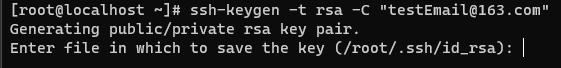
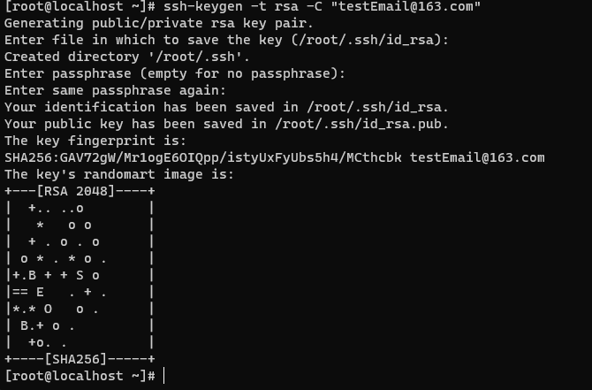
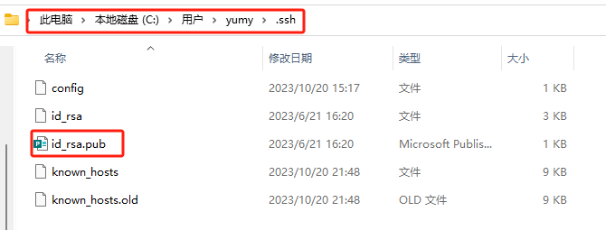
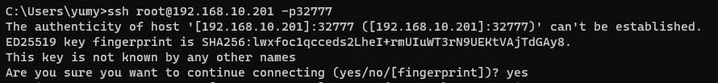
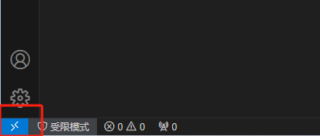
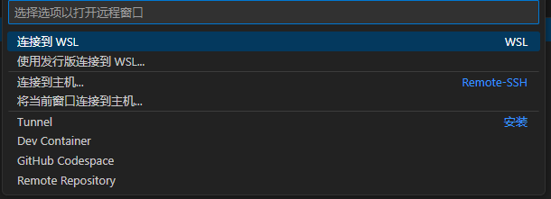
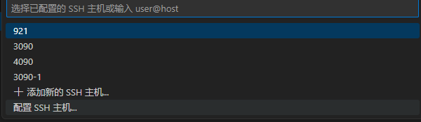
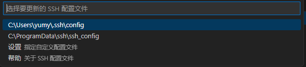
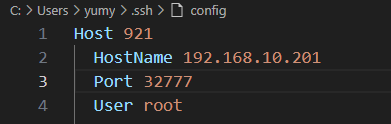
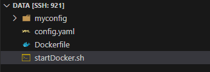

## 921实验室服务器管理系统
- 后端开发不完善，需要联系管理员创建和启动容器
#### GPU服务器登录
**容器和主机的挂载路径为 ```/data```，用户需要将自己的文件和数据存放到该目录下**

**系统预先安装了 ```workplace``` 环境。安装了 ```pytorch```等包,其中 ```python == 3.8```**
1. **生成本地公私钥文件**
- 输入 ```win + r```打开dos命令行
- 输入命令 ```ssh-keygen -t rsa -C "yourEmailAddress@email.com"```
- 之后一直回车即可
  - 
- 界面输出下面结果即为完成
  - 
- 将生成的公钥发送给管理员。在windows系统中，id_rsa.pub文件默认位置为 ```C:\Users\account\.ssh```
  - 

2. **远程连接服务器**
- 以dos为例
  - 打开dos，输入 ```ssh root@192.168.10.201 -p{port}```，其中 ```port```由管理员提供
  - 输入```yes```回车即可登录到服务器
    - 
- 以vscode为例
  - 点击打开远程窗口
    - 
  - 选择 ```连接到主机 Remote SSH```
    - 
  - 选择配置SSH主机
    - 
  - 更新配置文件,保存即可
    - 
    - 
  - 再次打开```连接到主机 Remote SSH``` 选择921
    - 
  - 打开服务器的```/data``` 目录即可

